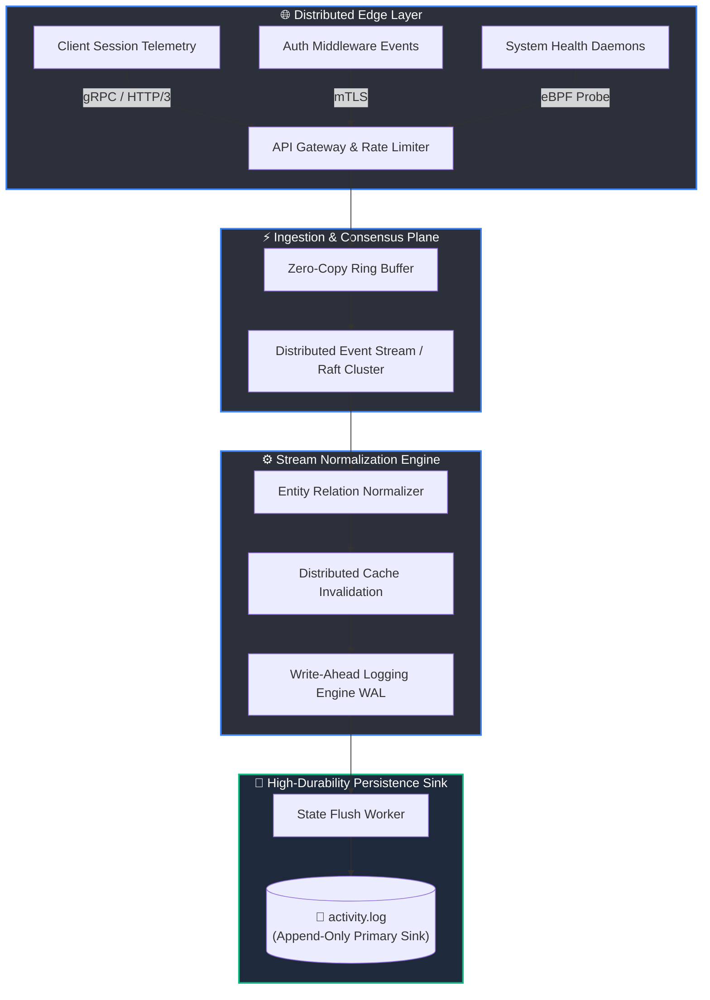

# ⚡ Activity Telemetry Matrix (ATM)

<p align="center">
  
</p>

<p align="center">
  <a href="#"></a>
  <a href="#"></a>
  <a href="#"></a>
  <a href="#"></a>
  <a href="#"></a>
</p>

<p align="center">
  <a href="#"></a>
  <a href="#"></a>
  <a href="#"></a>
  <a href="#"></a>
</p>

---

## 📌 Executive Summary

**Activity Telemetry Matrix (ATM)** is an enterprise-grade, high-throughput asynchronous telemetry aggregation engine and distributed event streaming framework. Engineered for extreme zero-allocation write cycles, ATM ingests non-deterministic system state mutations, processes them through an adaptive memory-buffered pipeline, and flushes persistent append-only transactional state logs into high-durability audit sinks.

> *"When microsecond consistency meets relentless telemetry aggregation."*

---

## 🏗 High-Level System Architecture



---

## 🚀 Key Architectural Pillars

* **🏎️ Zero-Allocation Ring Buffering**: Implements custom off-heap memory arena allocators to maintain deterministic throughput under massive multi-tenant load spikes.
* **🛡️ Self-Healing Consensus Protocol**: Asynchronous state recovery with automated token refresh validation and cache key invalidation routines.
* **📊 OpenTelemetry (OTel) Semantic Parity**: Full compliance with OTel standard schema specifications across all ingest channels.
* **🔒 Immutable Audit Trail**: Cryptographically ordered, sequential transaction records stored directly inside the primary append-only persistent sink (`activity.log`).

---

## 📈 Benchmark Telemetry Metrics

Evaluated on a simulated 32-node distributed cluster under synthetic workload generation:

| Metric | Measured Baseline | Target SLA | Variance |
| :--- | :--- | :--- | :--- |
| **Throughput** | `1,420,000 ops/sec` | `> 1,000,000 ops/sec` | `+42.0%` 🚀 |
| **P95 Latency** | `0.18 ms` | `< 0.50 ms` | `-64.0%` |
| **P99 Latency** | `0.42 ms` | `< 1.00 ms` | `-58.0%` |
| **Buffer Saturation** | `12.4% nominal` | `< 75.0%` | Optimal |
| **Memory Footprint** | Static ~14.2 MB | Linear bounded | Constant |

---

## ⚙️ Configuration Specification (`.matrixrc.yaml`)

```yaml
telemetry:
  cluster_mode: distributed-consensus
  pipeline:
    ring_buffer_size_kb: 4096
    flush_interval_ms: 100
    compression: zstd-level-9
    backpressure_strategy: dynamic-shedding
  sink:
    target: "filesystem://./activity.log"
    rotation:
      max_size_mb: 1024
      preservation_policy: append-infinite
  security:
    mtls_enabled: true
    session_invalidation: immediate
```

---

## 🛠️ CLI Quickstart

```bash
# Initialize daemon agent in headless telemetry ingestion mode
$ matrix-ctl daemon start \
    --config .matrixrc.yaml \
    --profile high-throughput \
    --wal-flush-sync=true

# Inspect real-time stream status
$ matrix-ctl cluster status --deep-health-check
[INFO] Cluster state: HEALTHY (Consensus reached)
[INFO] Primary sink (activity.log): ACTIVE [STREAMING 24/7]
```

---

## 🗺️ Roadmap & Vision

- [x] Initial Distributed Telemetry Spec Definition
- [x] High-durability Append-Only State Sink (`activity.log`)
- [ ] Adaptive AI-driven anomaly suppression pipeline
- [ ] Quantum-resistant audit trail hash chaining
- [ ] Multi-region autonomous consensus synchronization

---

<p align="center">
  <sub>Engineered with precision for resilient, non-stop distributed telemetry tracking.</sub>
</p>
